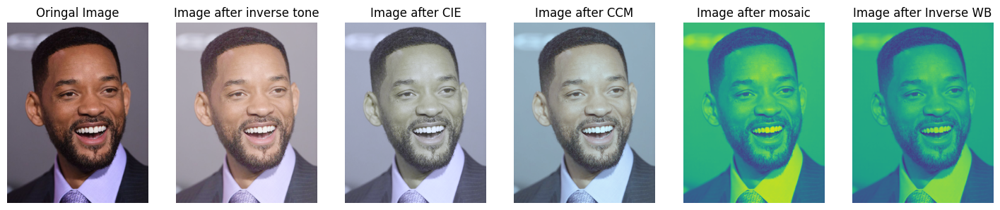
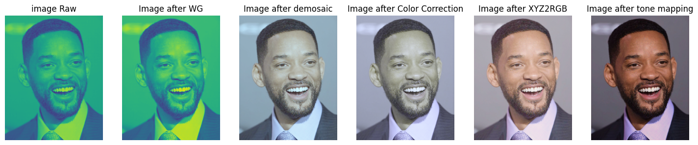
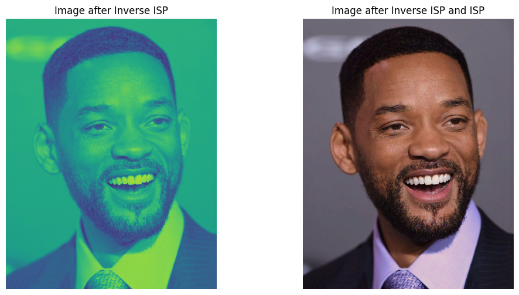
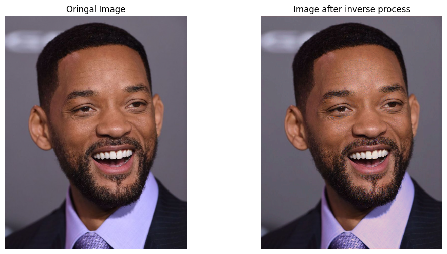

## 112-2 Computer Vision HW1 Report

智能所 312581029 廖永誠

## Questions:

1. Discuss different treatments of different Bayer patterns when: 
    - applying white balance mask into original image.
        目的是為了調整光源色溫對於圖片色溫的影響，比如說色溫較低(e.g. 3200K)就需要透過透過降低 R 跟 G Channel 的數值來提高 B Channel，也因此可以將圖片調的比較藍，反之也是一樣。
        由於在做白平衡的階段是在 RAW Image，所以就可以根據 Pattern 來對於指定的 Channel 乘上白平衡調整數值。
    - doing mosaic algorithm.
        目的是為了將 RGB 的圖像轉換回 RAW 圖像。
        要根據不同的 Pattern 來將每個 Channel 的值正確放到轉換完的位置。
        可以直接放的原因是因為原本在將 RAW 轉換成 RGB Channel 時對應的位置本來就是直接放，是那些原本沒有值的地方才會透過 interplot 補值，所以我們今天在做 mosaic 就不需要擔心。
2. Show the image results of each step as p.6/7 in HW1.pdf.
    - Inverse ISP Step Image
    
    - ISP Step Image
    
3. Show the image results of inverse ISP and ISP as p.16 in HW1.pdf. Additionally, compare the performance results of this task using PSNR.
    - Results of Inverse ISP and ISP
        
    - Compare Original and Inverse ISP + ISP
        
    - PSNR
        `80.022803298045503`

4. In recent AI de-noising methods, in order to generate paired data for training, we will add synthetic noise to clean image on RAW domain instead of RGB domain. Explain the reason.
    我認為是因為 RAW domain 圖片是最一開始從類比世界 Sample 進來的圖片，RGB 只是為了讓人眼可以正確接受圖片資訊才額外做的轉換，且很多值其實是透過運算得來的而不是真實的資訊。
    相比起人真的需要透過視覺細胞看懂圖像，對於 AI 訓練來說，圖片只是一連串的像素點而以，因此直接拿最真實沒有經過額外轉換運算的 RAW Image，更能學習到原始數據讓模型更好地學習去躁。