## 112-2 Computer Vision HW3 Report

智能所 312581029 廖永誠

## Result

### A. Compute the projection matrix from a set of 2D-3D point correspondences by using the least-squares (eigenvector) method for each image.

1. Projection Matrix of chessboard_1
    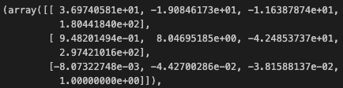

2. Projection Matrix of chessboard_2
    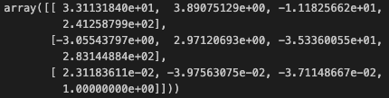

### B. Decompose the two computed projection matrices from (A) into the camera intrinsic matrices K, rotation matrices R and translation vectors t by using the Gram-Schmidt process. Any QR decomposition functions are allowed. The bottom right corner of intrinsic matrix K should be normalized to 1. Also, the focal length in K should be positive.

1. Intrinsic matrices K, rotation matrices R, translation vector t of chessboard_1
    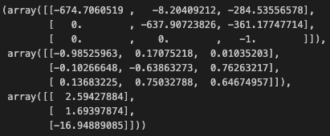

2. Intrinsic matrices K, rotation matrices R, translation vector t of chessboard_2
    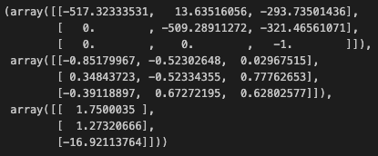

### C. Re-project 2D points on each of the chessboard images by using the computed intrinsic matrix, rotation matrix and translation vector. Show the results (2 images) and compute the point re-projection root-mean-squared errors.

1. chessboard_1

    - RMSE: `1.215364492113766`
    - Reprojection of chessboard_1
        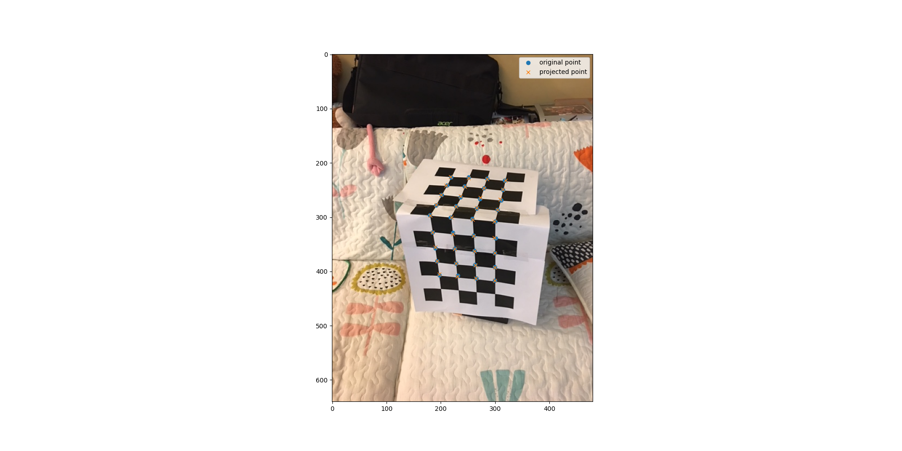

2. RMSE of chessboard_2

    - RMSE: `1.2567047507232436`
    - Reprojection of chessboard_2
        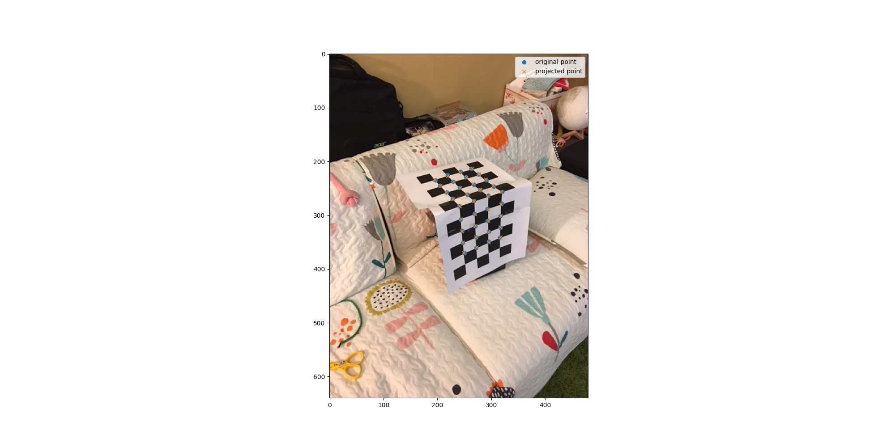

### D. Plot camera poses for the computed extrinsic parameters (R, t) and then compute the angle between the two camera pose vectors.

1. 3D Figure
    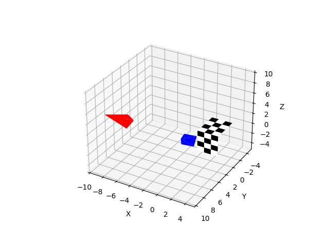

### E. Print out two “chessboard.png” in the attached file and paste them on a box. Take two pictures from different angles. For each image, perform the steps above (A ~ D).

#### A.

1. Projection Matrix of chessboard_3
    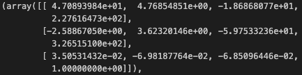

2. Projection Matrix of chessboard_4
    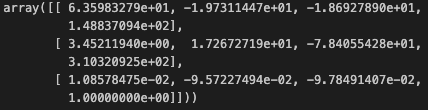

#### B.

1. Intrinsic matrices K, rotation matrices R, translation vector t of chessboard_3
    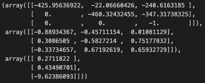

2. Intrinsic matrices K, rotation matrices R, translation vector t of chessboard_4
    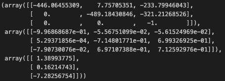

#### C.

1. chessboard_3

    - RMSE: `1.2991261192824033`
    - Reprojection of chessboard_3
        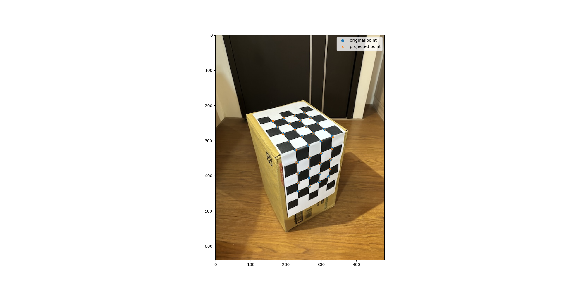

2. RMSE of chessboard_4

    - RMSE: `1.7794466288120552`
    - Reprojection of chessboard_4
        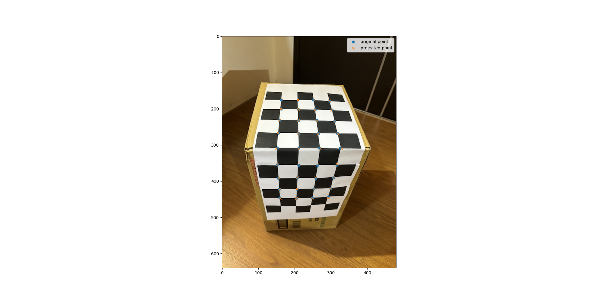

#### D.

1. 3D Figure
    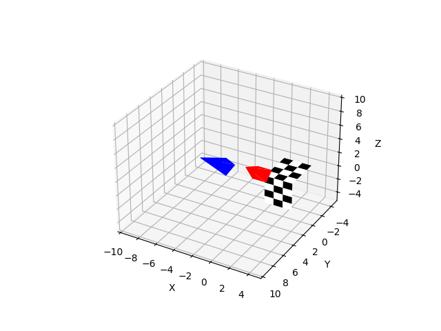

### F. Instead of mark the 2D points by hand, you can find the 2D points in your images automatically by using corner detection, hough transform, etc.

1. implementation

    - To implement the `detect_corners` function, I first read the input image and converted it to grayscale. Then, I applied the Harris corner detection algorithm to the grayscale image to compute the corner response for each pixel. Finally, I marked the pixels above a certain threshold as corners and drew circles on the original image to visualize the detected corners, saving the resulting image to the specified output path.

2. result

    - chessboard_3
        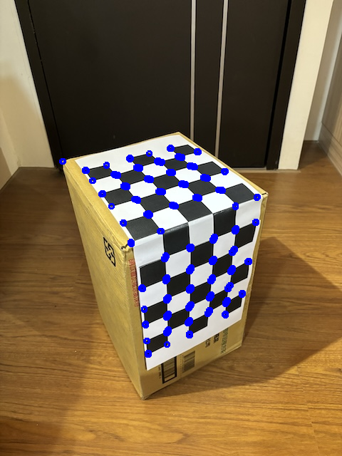
    
    - chessboard_4
        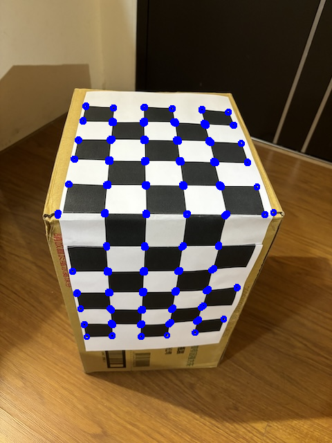
