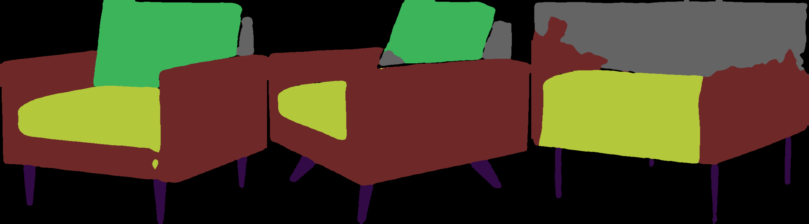

## 112-2 Computer Vision HW4 Report

智能所 312581029 廖永誠

## Result

## Description

- In this assignment, I trained 3 different models to do the semantic segmentation task on the dataset.

    1. Using the `deeplabv3_resnet50` model as the pretrained model, using transfer learning to train the model on 50 epochs.

    2. Using the `deeplabv3_resnet50` model as the model architecture, train the model from scratch on 50 epochs.

    3. Build a new CNN model by myself, train the model from scratch on 100 epochs. (The model architecture is shown in the `src/model.py` file.)

### 3 images of Validation results at different epochs.

#### ground truch

1. 0403, 0407, 0409

    

#### deeplabv3_resnet50_pretrained

1. epoch 5

    

2. epoch 20

    

3. epoch 50

    

#### deeplabv3_resnet50_scratch

1. epoch 5

    

2. epoch 20

    

3. epoch 50

    

#### my_model

1. epoch 5

    

2. epoch 20

    

3. epoch 50

    

### Test results consisting of 10 segmentation images.

- The images are saved in the `datasets/test/predict` folder.

- The images are using `deeplabv3_resnet50` model as the pretrained model, using transfer learning to train the model on 50 epochs.

- You can also check the other prediction results in the `datasets/test/all_prediction` folder.

###  Implement an IoU function to calculate the IoU value for each segmentation results and the overall mIoU

- The IoU function is implemented in the `inference.py` file. The function name are `calculate_iou` and `calculate_class_iou`.

- I implement those function by first extract each class mask from the ground truth and the prediction, then calculate the intersection and union of the mask, and finally calculate the IoU value.

- The result of the IoU value for each segmentation results and the overall mIoU are shown in the following table.

    | Class | 0401 | 0402 | 0403 | 0404 | 0405 | 0406 | 0407 | 0408 | 0409 | 0410 |
    | --- | --- | --- | --- | --- | --- | --- | --- | --- | --- | --- |
    | background | 0.9691 | 0.9521 | 0.9710 | 0.9654 | 0.9461 | 0.9646 | 0.9329 | 0.9513 | 0.9516 | 0.9550 |
    | 椅子底 (黃色) | 0.9608 | 0.9918 | 0.9803 | 0.9785 | 0.9782 | 0.9770 | 0.9619 | 0.9698 | 0.9572 | 0.9779 |
    | 扶手 (咖啡色) | 0.9612 | 0.9741 | 0.9842 | 0.9826 | 0.9747 | 0.9717 | 0.9872 | 0.9529 | 0.6129 | 0.9722 |
    | 椅腳 (黑色) | 0.9058 | 0.9483 | 0.9228 | 0.9345 | 0.9258 | 0.9128 | 0.0000 | 0.8925 | 0.8869 | 0.9183 |
    | 椅墊 (綠色) | nan | nan | 0.9823 | nan | nan | nan | 0.9777 | nan | nan | nan |
    | 椅背 (灰色) | 0.9863 | 0.9866 | 0.9311 | 0.9681 | 0.9805 | 0.9807 | 0.9488 | 0.5011 | 0.3519 | 0.9824 |
    | Mean IOU | 0.9535 | 0.9752 | 0.9601 | 0.9659 | 0.9648 | 0.9606 | 0.9689 | 0.8291 | 0.7022 | 0.9627 |

- This result is using the `deeplabv3_resnet50` model as the pretrained model, using transfer learning to train the model on 50 epochs.